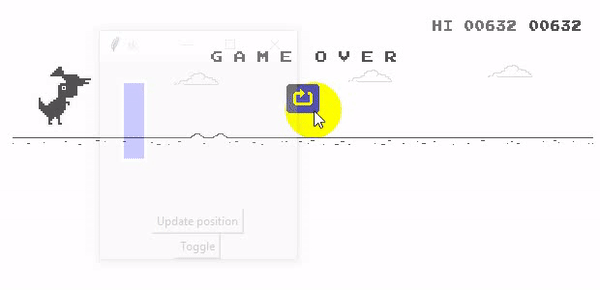

# t-rex-bot
A python bot for the T-rex hidden game of Chrome

# Requirements
This bot require pyautogui, Use the package manager pip to install it.
```bash
pip install pyautogui
```
# Usage
-excute bot.py
```bash
py bot.py
```
1. move the window and position the blue box where you want the cactus to be detected
2. press the update position button
3. press the toggle button


now it will press space whenever a cactus pass by the blue box position
